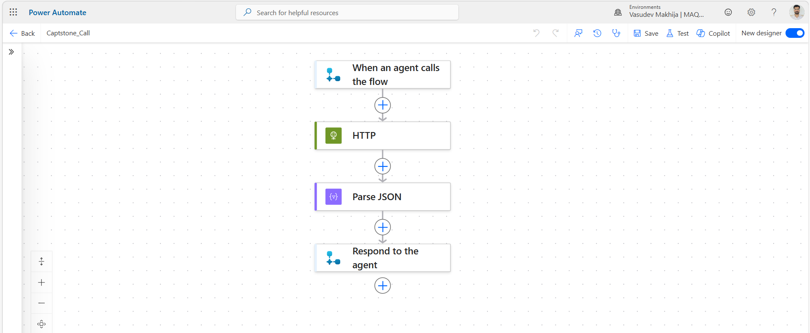
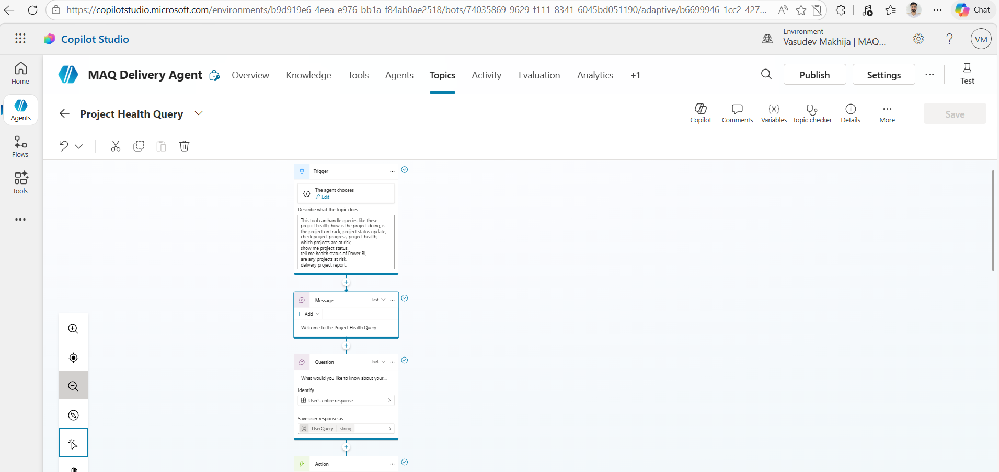
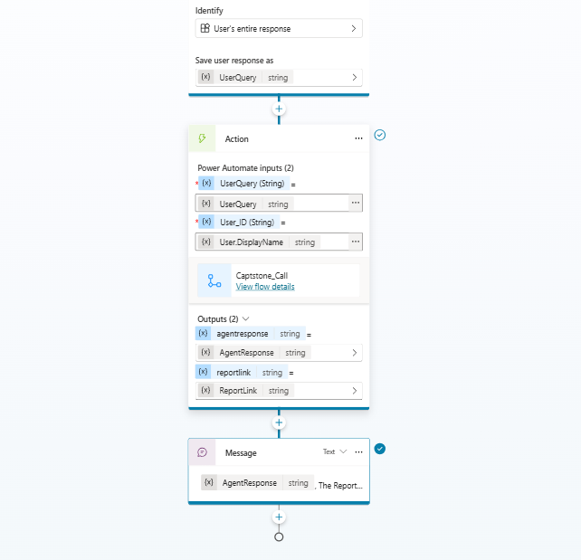
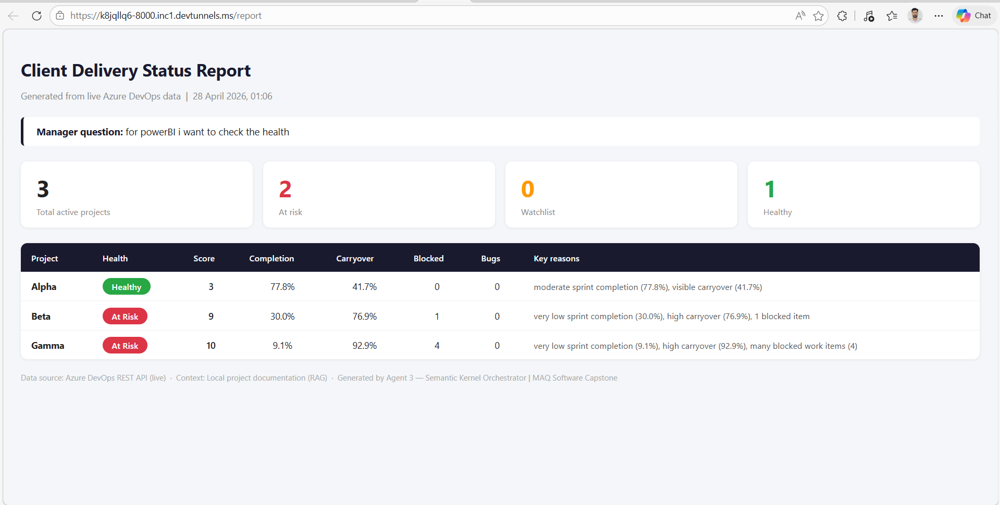

# 🚀 CAPSTONE: Intelligent Client Delivery Agent (FREE STACK)

## 📌 Project Overview

This project is an **end-to-end agentic system** designed to help managers track the health of active delivery projects using natural language queries.

Example Query:

> "What is the health of our active Power BI delivery projects?"

The system processes this query using multiple agents and generates insights along with a structured report.

> Earlier Project managers currently check **three separate systems** every morning to assess project health:

| System | What it has | What it lacks |
|---|---|---|
| Azure DevOps | Tasks, sprints, blocked items | No health summary |
| SharePoint | Project plans, milestones | Not connected to sprint data |
| D365 Timesheets | Hours and utilization | Separate from everything else |

This manual process takes approximately **45 minutes per manager per day**. Risks are often detected late. This system replaces that process with one natural language question in Teams.

The Agentic AI system answers that question in under 30 seconds — fetching live data from Azure DevOps, analysing risks using Hybrid RAG, and returning a professional HTML dashboard — all with zero cloud licensing cost.

> A project manager opens Microsoft Teams and types:

> *"What is the health of our active Power BI delivery projects?"*

Within 30 seconds, the system responds with a live HTML dashboard showing:

- **Alpha** → 🟢 Healthy
- **Beta** → 🟡 Watchlist
- **Gamma** → 🔴 At Risk

Each project shows completion percentage, carryover percentage, blocked item count, open bug count, and the specific key reasons behind its health classification — all pulled live from Azure DevOps at the moment the question was asked.
---

## 🧠 System Architecture

### 1️⃣ Intake Agent — Copilot Studio / Custom UI

* Deployed on Microsoft Teams in the Copilot Studio version

 Copilot Studio platform link : [https://www.loom.com/share/f457ced8d530459bba717eae2171a068](https://www.loom.com/share/f457ced8d530459bba717eae2171a068)

* Also implemented as a custom UI so the same workflow can be run without depending only on Copilot Studio which is paid
* Accepts natural language queries from managers
* Sends the query to the backend for processing

### 2️⃣ Data Retrieval Agent — AutoGen (OSS)

* This is the brain that fetches relevant information. This agent is responsible for collecting and preparing project data from different sources before analysis happens.

* It gathers information from:

  * SharePoint exports (CSV/JSON)
  * Azure DevOps (REST API)
  * D365 Timesheets (CSV)

* It is also used to sync or update Azure DevOps data by creating and refreshing project work items.

* Uses:

  * **HuggingFace sentence-transformers** to convert project documents into vector embeddings (locally, for free)
  * **ChromaDB** as a local vector store to do semantic similarity search
  * **LlamaIndex BM25** for keyword-based search — combined with ChromaDB this gives you *Hybrid RAG* (Retrieval-Augmented Generation)
  * **FastMCP** as a tool/plugin layer so the agent can call the Azure DevOps REST API (free tier) for live sprint data
  * Data sources: SharePoint exports as CSV/JSON, DevOps sprint data via REST, D365 timesheet CSVs

### 3️⃣ Insight Orchestrator — Semantic Kernel

* This agent takes the retrieved project data and turns it into meaningful business insight.
* It combines signals from multiple sources and creates a complete project status view.
* Uses Hybrid RAG:

  * BM25 (LlamaIndex)
  * Semantic search (ChromaDB)
* Detects at-risk projects, delays, blockers, and low-health delivery signals
* Generates a formatted HTML status report that can be shown to managers

## ⚙️ Tech Stack

* Copilot Studio
* AutoGen (OSS)
* Semantic Kernel (OSS)
* LlamaIndex (OSS)
* ChromaDB (OSS)
* HuggingFace sentence-transformers
* FastMCP
* Azure DevOps (Free Tier)
* Application Insights (Free Tier)
* Power Automate

---

---

## 📁 Project Structure — Every File Explained

```
capstone/
│
├── main.py                  FastAPI backend. Exposes /query and /report.
│                            Receives the manager's question, runs both agents,
│                            logs with user identity, serves the HTML report.
│
├── agent2_retrieval.py      Agent 2 — the intelligent search engine.
│                            Calls devops_fetcher to refresh live data.
│                            Builds ChromaDB + BM25 indices for Hybrid RAG.
│                            hybrid_retrieve() merges semantic + keyword results.
│                            detect_risks() applies business logic thresholds.
│                            AutoGen AssistantAgent generates the structured answer.
│
├── agent3_orchestrator.py   Agent 3 — the report generator.
│                            Semantic Kernel orchestration pipeline.
│                            calculate_health() scores each project 0-10.
│                            render_html_report() generates the HTML dashboard.
│                            Saves report_output.html on every query.
│
├── devops_fetcher.py        Live data pipeline. Called before every query.
│                            Authenticates to Azure DevOps via PAT token.
│                            Fetches all work items and sprints via REST API.
│                            Calculates per-project metrics from real data.
│                            Embeds passages as vectors → stores in ChromaDB.
│
├── ado_alpha.py             Demo data seeder for Azure DevOps Alpha project.
│                            Creates sprints, user stories, bugs, blocked tasks.
│                            Run once before the demo to populate Azure DevOps.
│
├── ado_beta.py              Same seeder for Beta project.
│
├── ado_gamma.py             Same seeder for Gamma project.
│
├── load_data.py             Legacy loader for static CSV files into ChromaDB.
│                            Kept as fallback. Superseded by devops_fetcher.py.
│
├── data/
│   ├── projects.csv         Static project metadata (fallback)
│   ├── sprints.csv          Static sprint data (fallback)
│   ├── timesheets.csv       Static D365 timesheet data (fallback)
│   ├── work_items.csv       Static work item data (fallback)
│   ├── milestones.csv       Static milestone data (fallback)
│   └── risks.json           Static risk register (fallback)
│
├── chroma_db/               Local vector database — auto-created on first run.
│                            Stores all passages as 384-dimensional vectors.
│                            Refreshed from Azure DevOps before every query.
│
├── report_output.html       Generated HTML dashboard — auto-created on every query.
│                            Health scores, KPI cards, traffic lights per project.
│
└── agent_logs.txt           Audit log. Every query, user identity, health score,
                             and report generation logged with timestamp.
```

---

## ✅ Prerequisites

1. **Python 3.10 or higher**
   ```bash
   python --version
   ```

2. **Ollama** — download from [ollama.com](https://ollama.com) and install like any normal app

3. **Azure DevOps account** — free at [dev.azure.com](https://dev.azure.com)  
   Create three projects named exactly: `Alpha`, `Beta`, `Gamma`

4. **Azure DevOps PAT token**  
   Profile picture → Personal Access Tokens → New Token  
   Scopes needed: **Work Items (Read & Write)**, **Project and Team (Read)**  
   Copy it immediately — it only shows once.

5. **Copilot Studio access** — via your Microsoft/MAQ work account at [copilotstudio.microsoft.com](https://copilotstudio.microsoft.com)

---

## ⚙️ Installation

### Step 1 — Clone the repository

```bash
git clone https://github.com/your-username/intelligent-client-delivery-agent.git
cd intelligent-client-delivery-agent
```

### Step 2 — Create and activate a virtual environment

```bash
python -m venv capstone-env

# Windows
capstone-env\Scripts\activate

# Mac / Linux
source capstone-env/bin/activate
```

### Step 3 — Install all dependencies

```bash
pip install -r requirements.txt
```

### Step 4 — Pull the local LLM (run once)

```bash
ollama pull llama3.2
```

Downloads approximately 2GB. Cached locally after the first pull.

### Step 5 — Configure Azure DevOps credentials

Open `devops_fetcher.py` and update:

```python
DEVOPS_ORG = "your-org-name"     # the part after dev.azure.com/
PAT_TOKEN  = "your-pat-token"    # from Azure DevOps Personal Access Tokens
```

## 🌱 Seeding Azure DevOps with Demo Data

Run the seeder scripts **once** before your demo to create realistic work items in Azure DevOps:

```bash
# Update DEVOPS_ORG and PAT_TOKEN at the top of each file first

python ado_alpha.py
python ado_beta.py
python ado_gamma.py
```

Each script creates sprints, user stories, bugs, and tasks with varied completion rates — so Alpha shows as Healthy, Beta as Watchlist, and Gamma as At Risk during the demo.

---
---

## ▶️ How to Run the Project


### Step 1: Run the command in the terminal tu run this in the virtual environment.

      capstone-env\Scripts\Activate.ps1

### Step 2: Create Azure DevOps Projects

Create these three projects in Azure DevOps first:

* **Alpha**
* **Beta**
* **Gamma**

link : [https://dev.azure.com/](https://dev.azure.com/)

### Step 3: Configure Azure DevOps Connection

Update the following values in the `ado_alpha`, `ado_beta`, and `ado_gamma` code:

* **Organization**
* **PAT (Personal Access Token)**
* **Project name**

### Step 4: Run the Data Update Code

Run the Azure DevOps updated script ( `ado_alpha`, `ado_beta`, and `ado_gamma` ). This will create and update project data inside Azure DevOps, including work items.

### Step 5: Run load_*data.py and devops_*fetcher.py code

### Step 6 — Start Ollama (keep this terminal open)

```bash
ollama serve
```

Expected output: `Listening on 127.0.0.1:11434`

### Step 7 — Start the FastAPI backend

New terminal, activate `capstone-env`, then:

```bash
uvicorn main:app --reload --port 8000
```

Expected output:
```
INFO:     Uvicorn running on http://127.0.0.1:8000
INFO:     Application startup complete.
```

### Step 8 — Test the API via Swagger

Open: `http://127.0.0.1:8000/docs`

Click **POST /query** → **Try it out** → paste:

```json
{
  "query": "What is the health of our active Power BI delivery projects?",
  "user_id": "manager_001"
}
```

Click **Execute**. The system fetches live Azure DevOps data, runs both agents, and generates the report.

### Step 9 — View the dashboard

Open: `http://127.0.0.1:8000/report`

---

## 🌐 Making Port 8000 Public for Copilot Studio

Copilot Studio needs a **public HTTPS URL** to reach your API. Two options:

### Option A — VS Code Ports tab (Recommended for Codespaces)

1. Click the **Ports** tab in VS Code bottom panel
2. Find port `8000`
3. Right-click → **Port Visibility** → **Public**
4. Copy the **Forwarded Address** — e.g. `https://your-name-8000.app.github.dev`

Use this URL in your Power Automate flow.

### Option B — ngrok (Local machine)

```bash
ngrok http 8000
```

Copy the `https://abc123.ngrok-free.app` URL.

>  ngrok URLs change on restart. Update your flow URL if you restart ngrok.

---

---

## 🤖 Connecting Copilot Studio and Teams

### Create the Power Automate Flow

1. In Copilot Studio → **Flows** → **New flow** → **From blank**
2. Trigger: **When an agent calls the flow**
   - Input: `UserQuery` (Text)
   - Input: `UserId` (Text)
3. Add **HTTP** action:
   - Method: `POST`
   - URI: `YOUR-PUBLIC-URL/query`
   - Headers: `Content-Type` = `application/json`
   - Body (Formula mode):
     ```
     concat('{"query": "', UserQuery, '", "user_id": "', UserId, '"}')
     ```
4. Add **Parse JSON** on the HTTP response Body — generate schema from:
   ```json
   {"status": "success", "user_id": "user", "query": "query", "report": "report_output.html"}
   ```
5. Add **Respond to the agent**:
   - `AgentResponse` (Text) = `status` from Parse JSON
   - `ReportLink` (Text) = `YOUR-PUBLIC-URL/report`
6. Save and Publish the flow

  

### Create the Topic

1. **Topics** → **+ Add a topic** → **From blank**
2. Name: `Project Health Query`
3. Trigger phrases:
   ```
   project health
   which projects are at risk
   show me project status
   what is the health of our projects
   delivery project report
   power bi projects
   project risk
   ```
4. **Message** node: `"Welcome to the Project Health Query system."`
5. **Question** node: `"What would you like to know about your projects?"` → save as `UserQuery`
6. **Action** node → select `Captstone_Call` flow:
   - `UserQuery` → `UserQuery` variable
   - `UserId` → `System.User.DisplayName`
7. **Message** node: insert `AgentResponse` and `ReportLink` via variable picker `{x}`
8. Save

   
   

### Disable General Knowledge

**Topics** → **Conversational boosting** → turn **OFF** "Allow the AI to use its own general knowledge". This forces the bot to only use your flow — not the internet.

### Publish to Teams

**Publish** → **Channels** → **Microsoft Teams** → **Turn on Teams**

---

## 📡 API Endpoints

* `/query` → Accepts user query and returns insights
* `/report` → Generates structured HTML report

  

---

---

## 📊 How the Health Score Works

Each project is scored **0–10** from four signals pulled from live Azure DevOps data:

| Signal | Max Points | Logic |
|---|---|---|
| Completion % | 6 pts | ≥80% = 0, 60–80% = 2, 40–60% = 4, <40% = 6 |
| Carryover % | 2 pts | >60% = 2, 30–60% = 1, <30% = 0 |
| Blocked items | 2 pts | ≥4 = 2, 2–3 = 1, 0–1 = 0 |
| Open bugs | 1 pt | ≥3 = 1, <3 = 0 |

| Score | Label | Colour |
|---|---|---|
| 0 – 3 | Healthy | 🟢 Green |
| 4 – 6 | Watchlist | 🟡 Amber |
| 7 – 10 | At Risk | 🔴 Red |

Every classification is fully explainable — traceable to specific data points in Azure DevOps.

---

## 🔐 Security & Logging

* Simulated authentication using `user_id`
* Logging enabled via Application Insights
* Dev → Test pipeline using Azure DevOps

---


## 🔼 STEP-UP (Production Upgrade)

For enterprise-level deployment:

| Current (Free Stack) | Production Upgrade             |
| -------------------- | ------------------------------ |
| AutoGen              | Azure AI Foundry Agent Service |
| ChromaDB             | Azure AI Search                |
| Local Embeddings     | Azure OpenAI                   |

Benefits:

* Enterprise SLA
* Managed Identity
* Real-time data sync

---

## 📊 Key Features

* Multi-agent architecture
* Hybrid RAG (BM25 + Semantic Search)
* Real-time project insights
* Automated Azure DevOps work item generation
* Copilot Studio flow plus custom UI support
* Backend execution through FastAPI

## 🤝 Contribution

Feel free to fork and improve the project.

---

## 📧 Contact

For queries or collaboration, reach out via GitHub.
